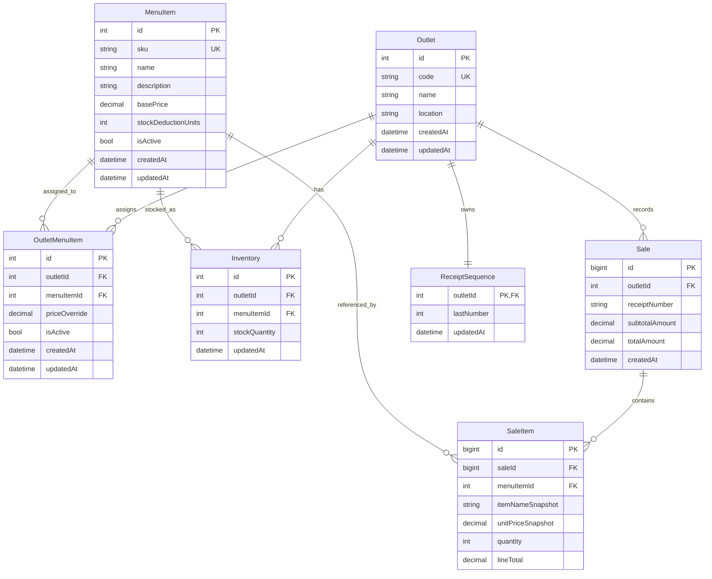

# ERD

```mermaid
erDiagram
    Outlet ||--o{ OutletMenuItem : assigns
    MenuItem ||--o{ OutletMenuItem : assigned_to
    Outlet ||--o{ Inventory : has
    MenuItem ||--o{ Inventory : stocked_as
    Outlet ||--o{ Sale : records
    Sale ||--o{ SaleItem : contains
    MenuItem ||--o{ SaleItem : referenced_by
    Outlet ||--|| ReceiptSequence : owns

    Outlet {
      int id PK
      string code UK
      string name
      string location
      datetime createdAt
      datetime updatedAt
    }

    MenuItem {
      int id PK
      string sku UK
      string name
      string description
      decimal basePrice
      int stockDeductionUnits
      bool isActive
      datetime createdAt
      datetime updatedAt
    }

    OutletMenuItem {
      int id PK
      int outletId FK
      int menuItemId FK
      decimal priceOverride
      bool isActive
      datetime createdAt
      datetime updatedAt
    }

    Inventory {
      int id PK
      int outletId FK
      int menuItemId FK
      int stockQuantity
      datetime updatedAt
    }

    Sale {
      bigint id PK
      int outletId FK
      string receiptNumber
      decimal subtotalAmount
      decimal totalAmount
      datetime createdAt
    }

    SaleItem {
      bigint id PK
      bigint saleId FK
      int menuItemId FK
      string itemNameSnapshot
      decimal unitPriceSnapshot
      int quantity
      decimal lineTotal
    }

    ReceiptSequence {
      int outletId PK,FK
      int lastNumber
      datetime updatedAt
    }
```
